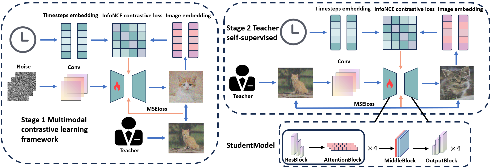

# TCCD: SELF-SUPERVISED TIME-CONSISTENT CONTRASTIVE DISTILLATION

## Summary of our paper
We propose TCCD, a novel data-free knowledge distillation framework for diffusion models built upon the Dynamic Iterative Distillation paradigm. TCCD introduces two synergistic stages. 

First, Timesteps-Noise Alignment via Multimodal Contrastive Learning strengthens temporal coherence and cross modal understanding by aligning timestep embeddings with corresponding noise representations, ensuring consistent feature learning across denoising steps. 

Second, Interactive Self-Supervised Learning enables the teacher model to iteratively guide the student by providing noise predictions, facilitating more accurate modeling of complex noise dynamics throughout the diffusion process. Architecture of the Proposed Method—TCCD details can be found in the figure below. 




## TCCD APPENDIX
For more details on the visualizations of TCCD, please refer to [TCCD_APPENDIX](TCCD_APPENDIX.pdf)


## Installation

```bash
conda create -n adm python=3.10 -y
conda activate adm

pip install torch torchvision torchaudio
pip install tqdm wandb blobfile timm thop omegaconf
pip install einops
conda install -c conda-forge mpi4py mpich
python3 -m pip install tensorflow[and-cuda]
pip install scipy requests tqdm

# make folders to save experimental results
cd guided-diffusion
mkdir -p experiments/cache; mkdir -p experiments/sample; mkdir -p experiments/kd
```

## Teachers

- **cifar10_32**: Download `ADM_cifar10_baseline.pt` in [DDPM-IP](https://github.com/forever208/DDPM-IP) and move it to `model/32x32_diffusion_cifar10.pt`.
- **celeba_64**: Download `DDPM_IP_celeba64.pt` in [DDPM-IP](https://github.com/forever208/DDPM-IP) and move it to `model/DDPM_IP_celeba64.pt`.
- **imagenet_32**: Download `DDPM_IP_imageNet32.pt` in [DDPM-IP](https://github.com/forever208/DDPM-IP) and move it to `model/DDPM_IP_imageNet32.pt`.

## TCCD

> `path/to/config` could be found in [Here](#config)

**① Preparation**: Prepare dynamic batch for TCCD

```bash
CUDA_VISIBLE_DEVICES=0 mpiexec -n 1 python scripts/dynamic_prepare.py --config path/to/config
```

Note: You can download the dynamic batches generated by the **DKDM** authors from [OneDrive](https://1drv.ms/f/s!ApmL4Zp8fxOMguRjsQdsGT7Nb85DTg?e=ZBeDRD), including `CIFAR10-Dynamic-0.4.cache`, `CelebA64-Dynamic-0.4.cache` and `ImageNet32-Dynamic-0.4.cache`. Then put them in `experiments/cache`.

**② Training**:

```bash
# cifar10_32, imagenet_32
CUDA_VISIBLE_DEVICES=0 mpiexec -n 1 python scripts/image_kd.py --config path/to/config
# celeba_64
CUDA_VISIBLE_DEVICES=0,1,2,3 mpiexec -n 4 python scripts/image_kd.py --config path/to/config
```

## Baselines

### Dynamic Iterative Distillation

You can reproduce the Dynamic Iterative Distillation baseline by following this link. <https://github.com/qianlong0502/DKDM>
### Data-Free Training

**① Preparation**: Prepare the synthetic dataset for baselines:

```bash
# cifar10_32
CUDA_VISIBLE_DEVICES=0,1,2,3 mpiexec -n 4 python scripts/image_sample.py --config yaml/cifar10_32/teacher.yaml --model_path model/32x32_diffusion_cifar10.pt --batch_size 2500 --num_samples 50000 --timestep_respacing 1000 --use_ddim False
# celeba_64
CUDA_VISIBLE_DEVICES=0,1,2,3 mpiexec -n 4 python scripts/image_sample.py --config yaml/celeba_64/teacher.yaml --model_path model/DDPM_IP_celeba64.pt --batch_size 300 --num_samples 202599 --timestep_respacing 100 --use_ddim False
# imagenet_32
CUDA_VISIBLE_DEVICES=0,1,2,3 mpiexec -n 4 python scripts/image_sample.py --config yaml/imagenet_32/teacher.yaml --model_path model/DDPM_IP_imageNet32.pt --batch_size 3072 --num_samples 1281167 --timestep_respacing 100 --use_ddim False
```

**② Data-Free Training**:

```bash
# cifar10_32, imagenet_32
CUDA_VISIBLE_DEVICES=0 mpiexec -n 1 python scripts/image_train.py --data_dir path/to/synthetic_data --config path/to/config
# celeba_64
CUDA_VISIBLE_DEVICES=0,1,2,3 mpiexec -n 4 python scripts/image_train.py --data_dir path/to/synthetic_data --config path/to/config
```

### Data-Limited and Data-Based Training

1. Refer to `datasets/mix.py` to generate the mixed dataset: 5% ~ 20% (Data-Limited Training), 100% (Data-Based Training).
2. Run the same command as above while specifying the path in data-free training to the mixed dataset.

## Evaluation

Note: Our setting are based on [DKDM](https://github.com/qianlong0502/DKDM), [guided-diffusion](https://github.com/openai/guided-diffusion) and [DDPM-IP](https://github.com/forever208/DDPM-IP).


**① Prepare npz files**

**Note**: Here the setting is the same as [DDPM-IP](https://github.com/forever208/DDPM-IP).

- Download Dataset: CIFAR-10 (refer to `datasets/download_cifar10.py`), CelebA (from [GoogleDrive](https://drive.google.com/drive/folders/0B7EVK8r0v71pTUZsaXdaSnZBZzg?resourcekey=0-rJlzl934LzC-Xp28GeIBzQ)), ImageNet-32 (from [ImageNet official website](https://image-net.org/download.php))
- Generate npz files: Refer to `evaluations/cifar_npz.py`, `evaluations/celeba64.npz` and `evaluations/imagenet32_npz.py`, run these scripts to get `cifar10_train.npz`, `celeba64_train.npz` and `ImageNet32_train_all.npz`.

**② Sample images from the trained models**

```bash
CUDA_VISIBLE_DEVICES=0 mpiexec -n 1 python scripts/image_sample.py --config /path/to/config --model_path /path/to/model --batch_size 2500 --num_samples 50000 --timestep_respacing 50 --use_ddim False
```

**③ Evaluation**

```bash
python evaluations/evaluator.py path/to/cifar10_train.npz path/to/sample_batch.npz
```


## Config

### cifar10_32

**Main Experiment**

- DKDM: `yaml/cifar10_32/exp/CIFAR10-14M-TCCD-0.4.yaml`
- Baseline: `yaml/cifar10_32/exp/CIFAR10-14M-Baseline.yaml`

**Different Architectures**

- 57M CNN Architecture
  - DKDM: `yaml/cifar10_32/exp/CIFAR10-57M-TCCD-0.4.yaml`
  - Baseline: `yaml/cifar10_32/exp/CIFAR10-57M-Baseline.yaml`
- 44M CNN Architecture (residual blocks: 3 -> 2)
  - DKDM: `yaml/cifar10_32/exp/CIFAR10-44M-TCCD-0.4.yaml`
  - Baseline: `yaml/cifar10_32/exp/CIFAR10-44M-Baseline.yaml`
- 32M CNN Architecture (channels: 128 -> 96)
  - DKDM: `yaml/cifar10_32/exp/CIFAR10-32M-TCCD-0.4.yaml`
  - Baseline: `yaml/cifar10_32/exp/CIFAR10-32M-Baseline.yaml`
- 24M CNN Architecture (residual blocks: 3 -> 2, channels: 128 -> 96)
  - DKDM: `yaml/cifar10_32/exp/CIFAR10-24M-TCCD-0.4.yaml`
  - Baseline: `yaml/cifar10_32/exp/CIFAR10-24M-Baseline.yaml`
- 14M CNN Architecture (channels: 128 -> 64)
  - DKDM: `yaml/cifar10_32/exp/CIFAR10-14M-TCCD-0.4.yaml`
  - Baseline: `yaml/cifar10_32/exp/CIFAR10-14M-Baseline.yaml`


### celeba_64

- DKDM: `yaml/celeba_64/exp/CelebA64-57M-Dynamic-0.4.yaml`
- Baseline: `yaml/celeba_64/exp/CelebA64-57M-Baseline.yaml`

### imagenet_32

- DKDM: `yaml/imagenet_32/exp/ImageNet32-14M-Dynamic-0.4.yaml`
- Baseline: `yaml/imagenet_32/exp/ImageNet32-14M-Baseline.yaml`
